Bucket
======

This is a tool made to transfer and backup photos from a professional camera while in-the-field. Built with a Raspberry Pi 4 (other Pis will work too, it's all just Python code), using Wi-Fi for file transfers and USB disks for file storage, powered by batteries.

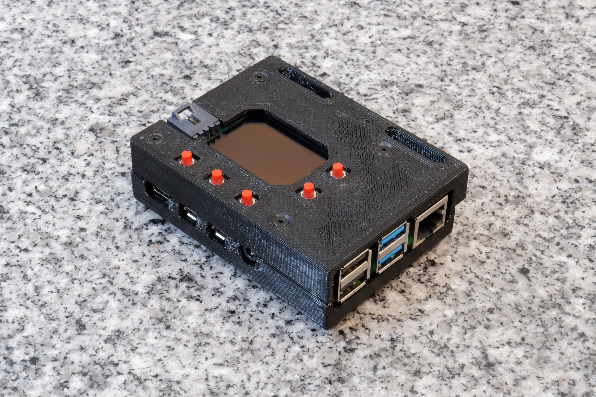

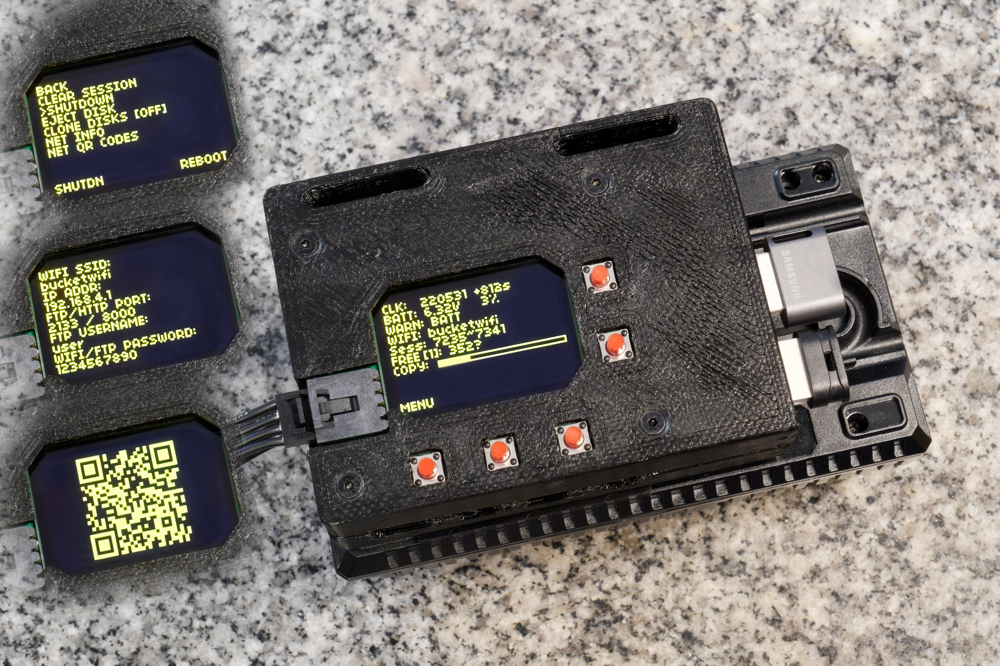

Problem
----

The problem I'm trying to solve is a really stupid first-world-problem... While on photography trips, I'm running out of storage on my camera's memory cards. They are expensive memory cards and I can't buy too many of them. I don't want to go back to a hotel before clearing out a memory card either.

So the strategy is to wirelessly transfer the files into a cheaper-slower-but-bigger storage device (TB sized USB disks) simultaneously as the camera is shooting. The slower speed should be fine because the transfers will happen during the down-time, when I'm walking around not taking pictures. USB disks at this size typically cost just a bit over $100 (genuine, authentic, non-scam ones) and require USB-3.0 ports.

Once the photos are in the bigger storage device, I can clear the expensive-and-smaller memory cards without going back to a hotel, using in-camera quick-reformat.

This project needs to be done by late June of 2022, my next vacation. (I hope this explains some very weird decisions I've made)

Features
----

Runs as a FTP server for professional cameras to transfer photos into. A redundant copy of the photo is made if 2 USB disks are inserted. (most professional cameras have two card slots for the purpose of having redundancy as well)

Copies photos from SD card if a SD card reader is inserted into a USB port. Or plug in the camera itself (configure it to run in mass storage mode, and disable USB charging).

The file-names for the photos are typically numbered from 0 to 9999. This isn't a lot of photos and rolls over quickly. When a photo is copied, it is automatically renamed with a much longer number that indicates the date it was taken. The date makes every photo file-name unique and can be easily searched-for and sorted.

EXIF data of the photo is checked for the photo's 5-star rating, if it is rated in-camera, then it is automatically marked for keeping.

Performs disk-cloning when multiple USB disks are inserted.

Uses a HTTP server to show an image gallery in a web browser. The user can choose to keep or delete a photo from the web-page. Each photo is checked for where the camera focused on, and a zoomed-in cropped thumbnail is shown to the user showing where the camera focused (which is even cooler since my camera have AI driven bird-eye-detect).

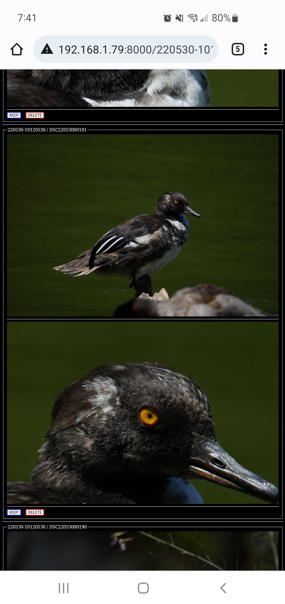

This allows for a very quick decision whether or not an image is in-focus enough to keep. This implementation keeps the file-sizes small for the web-page, but the user can still click into the full resolution file too.

The software keeps track of the numbers in the file-names. If the number sequence skips a number, it might mean a missing photo, the missing number is shown to the user so they can check in the camera what happened. The camera can indicate a failed FTP transfer, but usually it just retries until it works. This is only useful when the camera is setup to transfer-as-you-shoot.

Hardware UX
----

The UI involves a 102x64 OLED screen and 5 buttons. It is very readable in all lighting conditions. The 5 buttons are divided into 2 up/down buttons and 3 action buttons.

The screen shows the most important information, such as the time (which is kind of like a heart-beat), the number of photos transferred, the amount of disk space remaining, etc.

There is a menu that can be accessed, the menu items are navigated with the up/down buttons. From the menu, the user can do things like initiate drive-cloning.

From the menu, the user can quickly check the Wi-Fi AP's credentials, the FTP IP address, and FTP credentials. It can also display the Wi-Fi credentials and HTTP URL as QR codes.

There is a buzzer that buzzes when there's a problem that requires the user's immediate attention, such as a disk running out of space, or if the battery is too low, etc. The user can press a button to acknowledge the problem to turn off the buzzer.

Hat Circuit and 3D Printed Box
----

This is the circuit I designed to go on top of the Raspberry Pi.

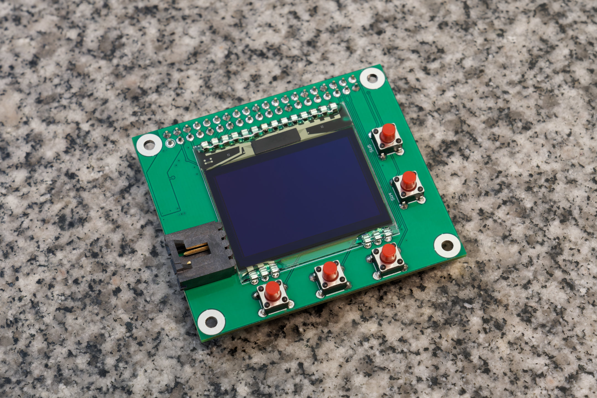

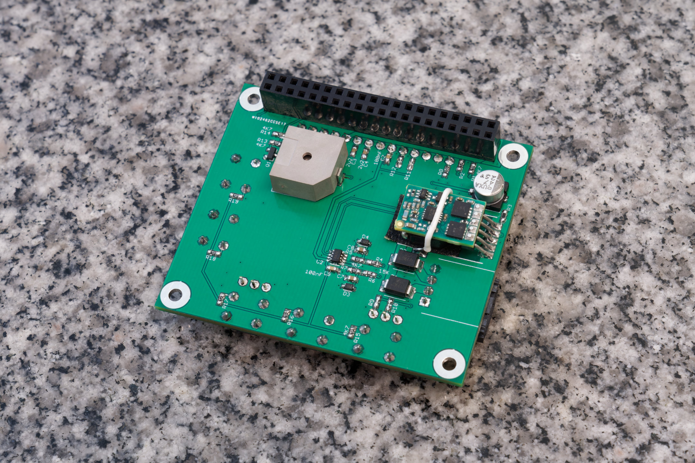

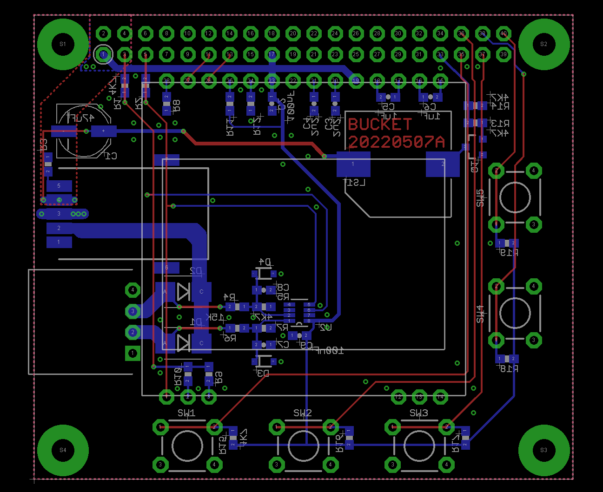

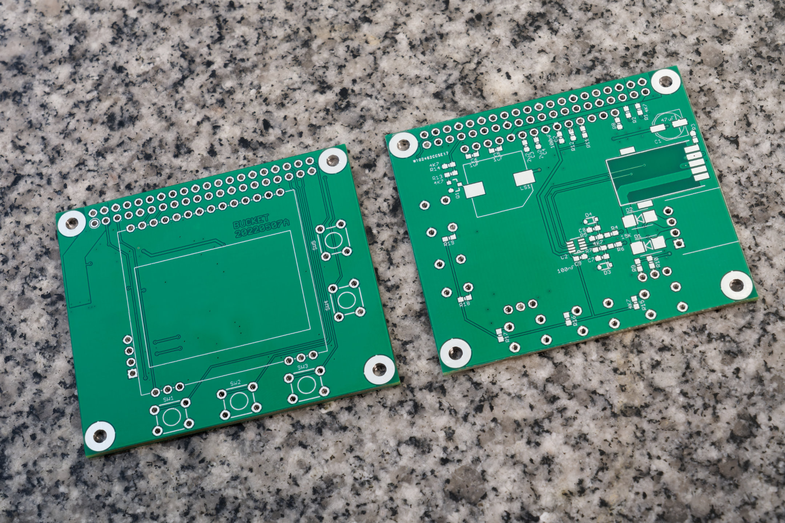

A 3D printed box is designed to protect the entire assembly. It is 3D printed in PETG plastic, because this whole thing gets super hot while running, PLA plastic just won't handle it.

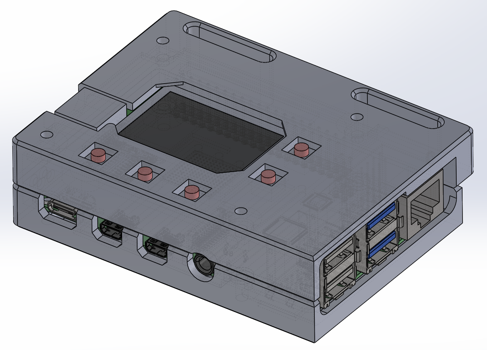

Software Architecture
----

This is just one massive Python project, spread across several modules. The hardware IO, various servers, and the main application, can all be independently tested. In fact, because Python is very cross-platform, I did most of my testing on Windows with a simulated screen.

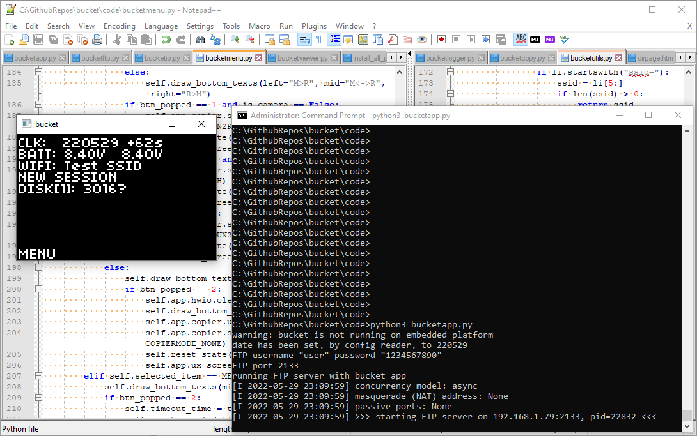

The intention is to improve the reliability of this project by making the Raspberry Pi's microSD card read-only. The Python script will scan all mounted disks for a config file when it starts. This way, the user can still specify some parameters without ever writing to the microSD card.

The Python script will also log events and errors to the first available mounted disk.

The Python script is called upon by `/etc/rc.local`.

The library I used for the FTP server is [pyftpdlib](https://pypi.org/project/pyftpdlib/). The server class can be inherited, callback functions can be added, and a lot of the pathing functions had to be overridden.

The UI used a combination of [CircuitPython](https://circuitpython.org/) (and including the adafruit-circuitpython-ssd1306 library), [gpiozero](https://gpiozero.readthedocs.io/), and [Pillow](https://pillow.readthedocs.io/)

The HTTP server used Python's [built-in HTTP server library](https://docs.python.org/3/library/http.server.html). The HTML pages contains some [JQuery](https://jquery.com/) and uses lazy-loading images.

The EXIF related functions I borrowed [ExifTool](https://exiftool.org/), it's a Perl project but I call upon it as a subprocess from within Python.

USB disk auto-mounting is handled by [the usbmount Debian package](https://github.com/rbrito/usbmount/).

Threads
----

This device packs a bunch of features that involve IO against USB drives, and some of those tasks are more important. The software running has many threads that have multiple task queues with varying priorities.

The main thread is the GUI thread, which runs once every 0.2 seconds, giving a frame-rate of 5 FPS on the OLED display. Most of the thread time will be occupied by a very long I2C transaction as the frame-buffer is being sent to the OLED display. Other threads can run during this transfer without any penalty.

The FTP server and HTTP server both run on their own thread without any throttling, managed by their respective Python libraries. FTP is the most important thread. Wireless file transfer is the highest priority transfer, it isn't even queued, it happens immediately.

The other threads are started and stopped as needed: disk-cloner, keeper-copier, thumbnail-generator

The disk-cloner has two queues. The higher priority queue copies a recently wirelessly transferred file to the redundant disk. The lower priority queue copies between drives upon user request.

The keeper-copier slowly analyzes the EXIF data on recently transferred files to find their 5-star rating. Rated files are moved to the "keep" folder. These tasks has lower priority than the disk-cloner, but it also happens immediately if the user clicks the "keep" button on the HTTP server interface.

The thumbnail-generator thread is the lowest priority, but it becomes high priority when a HTTP client is accessing the thumbnails that have not been generating yet.

Power Supply
----

The hat circuit features a DC/DC step-down converter outputting 5V, rated for up to 6A. The input is supposed to come from two 8.4V batteries. The inputs are diode-OR'ed before going into the converter so I can swap one battery out without shutting down the Pi (and more importantly, prevents one battery literally exploding the other one). Each input is also connected to an ADC with a voltage divider in between.

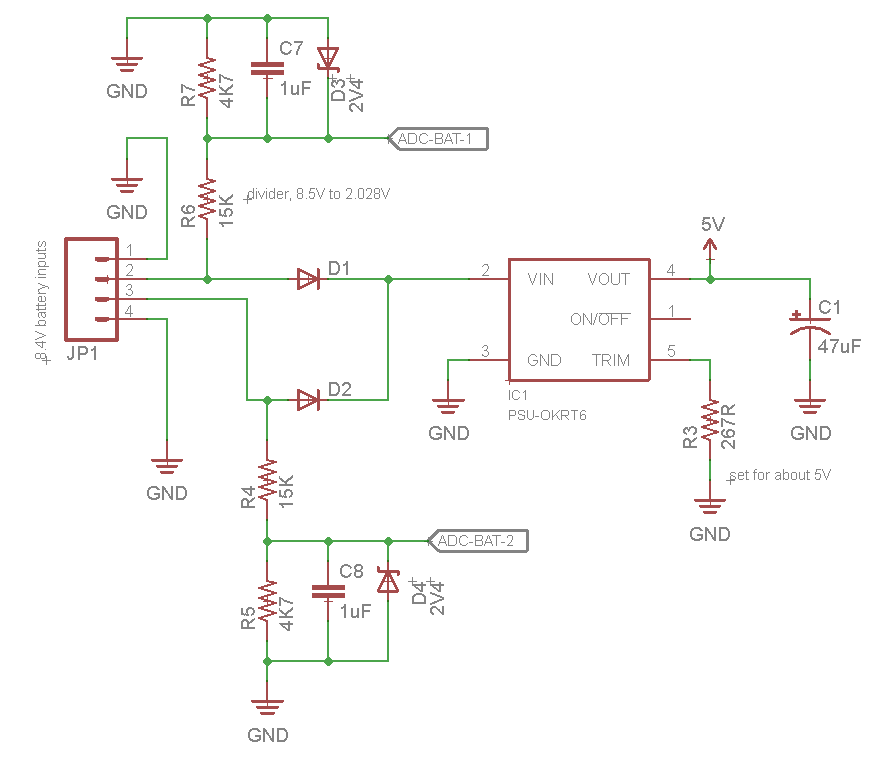

As for the batteries, I decided it would be smart to use the same FZ100 batteries that my cameras use, so I can carry less stuff. I hacked up a dual charger for FZ100 batteries so it became a battery holder. It will still charge the batteries too.

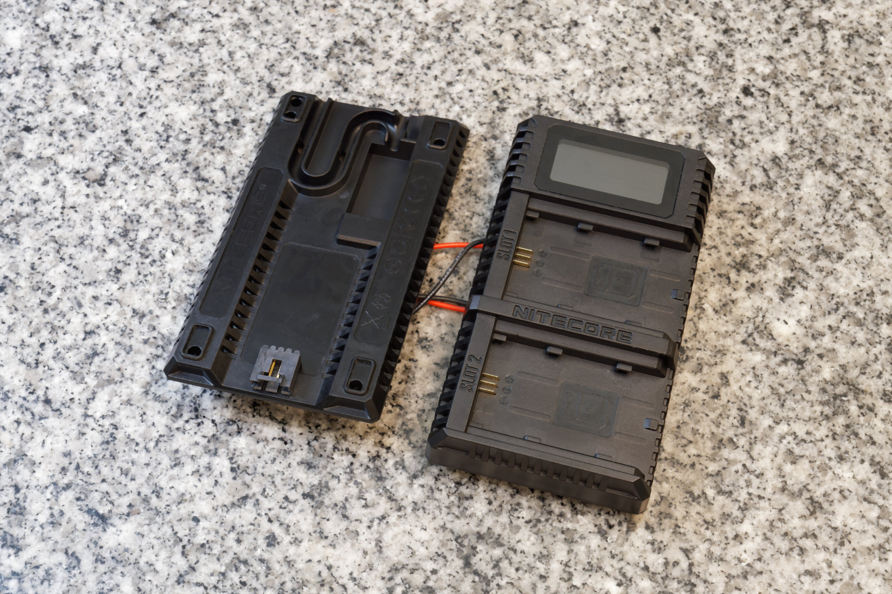

A latching beefy connector is placed on the bottom of the charger, and wired to the battery tabs of the charger. On the Pi's hat is the mating connector.

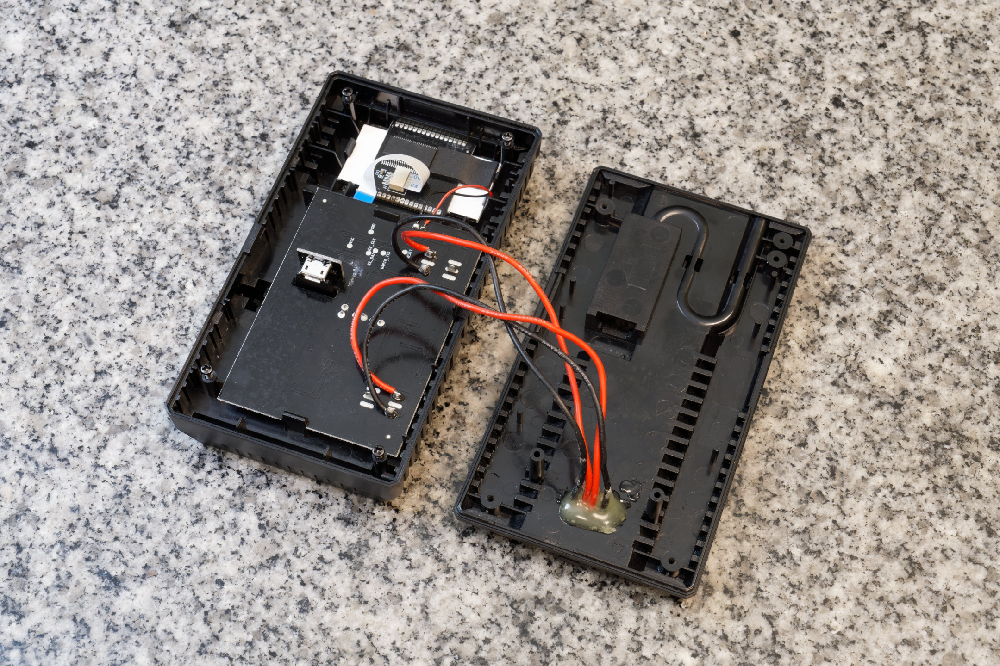

This charger is attached to the bottom of the Raspberry Pi via LEGO!

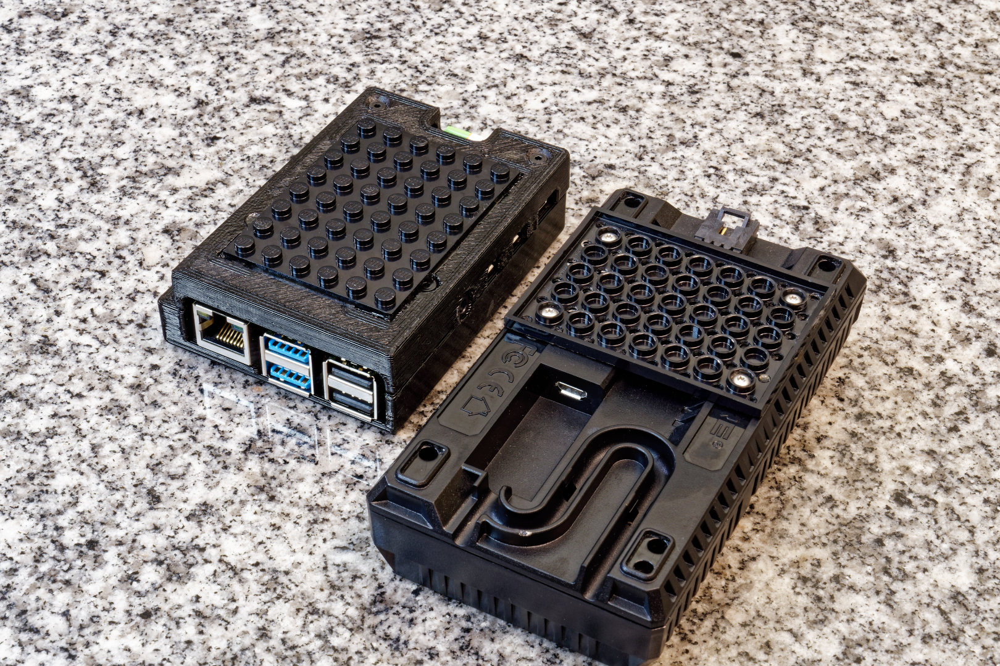

I think this whole project draws about under 1A during actual file transfer using USB flash drives, but a bit over 1A when I use a USB-C NVMe SSD. Roughly 4 to 5 hours of battery life.

Alternative Implementation
----

The Raspberry Pi 4 is absolutely horrible for a battery powered project, it has zero power saving features, there's no sleep mode, and draws a ton of current even if the whole CPU is halted. This whole project would've made a lot more sense if it was just a smartphone app.

But my phone doesn't have nearly enough internal storage for this project, the USB port on my phone is also very suspect and I don't want to have a USB hub inserted into it during hikes. I recently did a battery swap on my phone because I love it so much and want to use it for a few more years. So I hope you understand why I can't justify buying a 1 terabyte Galaxy S22 Ultra for this project.

I am interested in an Android app implementation of this device though. Contact me if you want to chat about it.
